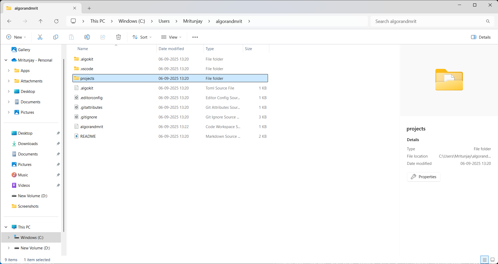

# 🎲 Algorand Coin Toss Game

A beginner-friendly **decentralized application (dApp)** built on **Algorand** using **TypeScript smart contracts**.  
This project demonstrates how to create a simple game on Algorand while keeping the code easy to understand and extend.  

---

## 📖 Project Description  

This project is a **coin toss game** deployed as an Algorand smart contract.  
Users can guess **Heads** or **Tails**, and the contract will generate an outcome.  
It’s a fun and simple way to learn how to build dApps on Algorand.  

---

## 🚀 What it does  

- Players submit a guess: `"Heads"` or `"Tails"`.  
- The smart contract generates an outcome (`Heads` or `Tails`).  
- If the player’s guess matches the outcome → **You win! 🎉**  
- Otherwise → **You lose ❌**  
- The result of the last coin toss is stored on-chain in **global state**.  

---

## ✨ Features  

- 🎲 Simple coin toss game logic  
- 🔒 Immutable game logic stored on Algorand  
- 🌍 Tracks the last game result in global state  
- 🏗️ Beginner-friendly smart contract structure  
- ⚡ Fast and low-cost execution thanks to Algorand  

---

## 📜 Deployed Smart Contract  

**Contract Link**: DYWZB4KODRB54X7K6FO4LYKNB3ANYRWEVQL3R6XWZB4NJK7YICCSOWQ7PY 

---

## 🛠️ Smart Contract Code  

```ts
//paste your code
import { Contract, GlobalState } from "@algorandfoundation/algorand-typescript";

// Simple Coin Toss Smart Contract
export class CoinToss extends Contract {

  // Store last result of the coin toss
  lastResult = GlobalState<string>({ key: "lastResult", initialValue: "" });

  // Player chooses Heads or Tails
  toss(guess: string): string {
    // Generate a "random" coin toss (0 = Heads, 1 = Tails)
    // NOTE: For real randomness, you would need an oracle or VRF
    const outcome = Math.floor(Math.random() * 2); 

    let result = outcome === 0 ? "Heads" : "Tails";

    // Save result in global state
    this.lastResult.value = result;

    // Return win/lose message
    if (guess === result) {
      return "You guessed " + guess + " 🎉 Correct!";
    } else {
      return "You guessed " + guess + " ❌ Wrong, it was " + result;
    }
  }

  // Check the last game result
  checkLastResult(): string {
    return this.lastResult.value;
  }
}

